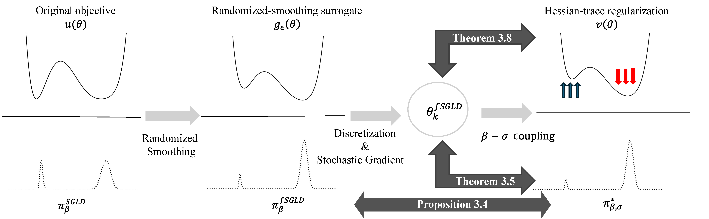

# Flatness-Aware Stochastic Gradient Langevin Dynamics

<p align="center">
  
</p>


This is the code implementation for 2026 ICML "Flatness-Aware Stochastic Gradient Langevin Dynamics". 


## Table 1,2
Please refer `code/EMCMC/READEME.md`.

## Table 3,4

### Setup
First, install the required dependencies:

```bash
pip install -r requirements.txt
```

### Data Preparation

Set a common root, e.g., `--data_root ./data`. The expected directory layout is:

```
./data/
├── CIFAR
└── WebVision
```
### CIFAR-N
For CIFAR-10N/CIFAR-100N, we follow the official repository: https://github.com/UCSC-REAL/cifar-10-100n/tree/main

### WebVision
For WebVision, we replicate the repository: https://github.com/sangamesh-kodge/Mini-WebVision

Run the following command in `data/WebVision`:

```bash
sh create_MiniWebVision_as_ImageNet.sh
```

### Usage

To train the model for one configuration, run:

```bash
python main.py \
    --dataset $DATASET \
    --optimizer $OPTIMIZER \
    --backbone $BACKBONE  \
```

To conduct Optuna hyperparameter tuning, run:

```bash
python main_auto.py \
    --dataset $DATASET \
    --backbone $BACKBONE \
    --optimizer $OPTIMIZER \
    --n_trials $N_TRIALS \
    --epochs $EPOCHS \
    --save_dir $SAVE_DIR
```

You may further control the learning strategy using the following options:

- `--beta_coupling`  
  Use together with `--optimizer fsgld` to enable a deterministic perturbation scale (σ).

- `--fixedbeta`  
  Fix the inverse temperature β⁻¹ during Optuna hyperparameter search.

- `--betavalue`  
  Specify the value of β⁻¹ when `--fixedbeta` is enabled.


### Examples

**(1) Single run: CIFAR-10N, ResNet-34, fSGLD**

```bash
python main.py --dataset cifar10N --optimizer fsgld --backbone resnet34_cifar --lr 0.1 --beta_inv 1e-8 --beta_coupling
```
Results will be saved in `results/cifar10N_resnet34_cifar_fsgld_sigma0.001_lr0.1/results.json`.

**(2) Hyperparameter tuning: WebVision, ResNet-50, fSGLD**

```bash
python main_auto.py \
  --dataset webvision --backbone resnet50 --optimizer fsgld \
  --n_trials 20 --epochs 150 --beta_coupling \
  --save_dir ./optuna_results/webvision_resnet50_fsgld 
```

Results will be saved in `optuna_results/webvision_resnet50_fsgld/webvision_resnet50_fsgld_optuna_study_results.json`.

**(3) Hyperparameter tuning: CIFAR-10N, ViT-B-16, fSGLD**
```bash
python main_auto.py \
  --dataset cifar10N --backbone vit_b_16 --optimizer fsgld \
  --n_trials 20 --epochs 75 \
  --save_dir ./optuna_results/cifar10N_vit_b_16_fsgld 
```


### Citation

If you find this repository useful in your research, please consider citing our paper:

```bibtex
@inproceedings{bruno2026flatness,
  title     = {Flatness-Aware Stochastic Gradient Langevin Dynamics},
  author    = {Bruno, Stefano and Hwang, Youngsik and An, Jaehyeon and Sabanis, Sotirios and Lim, Dong-Young},
  booktitle = {Proceedings of the 43rd International Conference on Machine Learning},
  year      = {2026}
}
```

